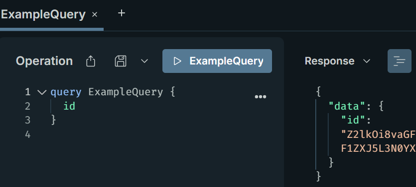

# Graph*i*QL Explorer

This tool allows you to explore any GraphQL API, like it also uses Graph*i*QL. This is very useful for security testing an API from the outside.

This means you'll be able to use the code completion and documentation visualization features of Graph*i*QL.

Sometimes GraphQL APIs also don't allow introspection, but using tools like [clairvoyance](https://github.com/nikitastupin/clairvoyance) you can brute-force some of the fields. With this tool you can also import the results of these tools by simply selecting a file to take the introspection from.

This application is running on Vercel over at <https://graphiql-explorer-delta.vercel.app/>

## Setup Browser

To setup your browser to allow requesting resources cross-origin you can look at the `/help/1` and `/help/2` pages.

## Usage

After allowing the browser to bypass CORS you can use the explorer to explore your GraphQL API. Start by inputting a URL in the field, and then execute any queries to the endpoint you want.
If you want to want to use a custom introspection file, you can select the option `Use custom introspection data from file` and then select the file you want to use.

## Example

As an example, lets try to connect to the HackerOne GraphQL API.

First open the tool with the command to bypass security features:

```cmd
chrome --disable-web-security --user-data-dir="%TEMP%\Chrome" https://graphiql-explorer-delta.vercel.app/
```

Then input the URL to the GraphQL endpoint you want to test:


In the DevTools console, you'll notice that we are **unauthenticated**, because the new browser uses an empty profile. Log into hackerone (or copy your cookies over) and reload the application.

Now, requests to the `/graphql` endpoint succesfully receive cookies, but another error response appears:

> Invalid CSRF token

We need to send a special `x-csrf-token` header for this implementation. You can easily grab one from `view-source:https://hackerone.com/hacker_dashboard/overview` while logged-in and click the cog icon to open *Connection settings*:


In here, you can add an extra header hardcoded to your CSRF token. Then *Save*. Finally, when you reload you should see succesful `/graphql` requests appear in the DevTools Network tab. From this point, you can run any queries and see the output:



There are still error messages about "Schema Introspection", this is because HackerOne does not allow this feature. Instead, if you can get your hands on a `schema.json` file somehow (eg. using [clairvoyance](https://github.com/nikitastupin/clairvoyance)), you can upload it on the first screen by checking the "Use custom introspection data from file" box. This should spoof the introspection information so you can get auto-completion on your queries.

## Development

Now that the app is running on vercel, it can be simulated using the following command during development:

```sh
vercel dev
```

If this doesn't work, you can instead it with your local Python like so:

```sh
gunicorn api.index:app -b 0.0.0.0:3000
```
